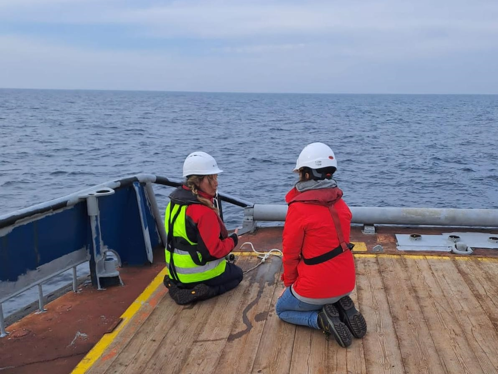
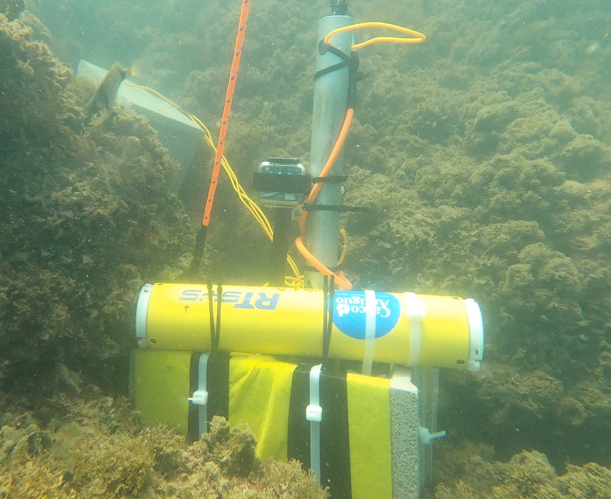

# Neus Perez-Gimeno

## Español

Investigación y proyectos relacionados con la acústica submarina, los paisajes
sonoros marinos, la conservación y la divulgación.

### Proyectos actuales

- **Posidonia Soundscapes: Conservation & Music, Ibiza**: paisajes sonoros
  asociados a praderas de *Posidonia oceanica* y al arte.
  [Repositorio](https://github.com/neuspergim/posidonia-soundscapes).
- **Pozas como refugios sonoros**: proyecto de paisaje sonoro y hábitat costero
  asociado a pozas intermareales.
  [Repositorio](https://github.com/neuspergim/la-caleta-soundscape).
- **SEANIMALMOVE**: proyecto situado en el Estrecho de Gibraltar. Acústica
  submarina, cetáceos y ruido antropogénico.
  [Repositorio](https://github.com/neuspergim/strait-of-gibraltar-soundscape).

## English

Research and projects related to underwater acoustics, marine soundscapes,
conservation, and public outreach.

### Current projects

- **Posidonia Soundscapes: Conservation & Music, Ibiza**: soundscapes associated
  with *Posidonia oceanica* seagrass meadows and art.
  [Repository](https://github.com/neuspergim/posidonia-soundscapes).
- **Rockpools as sound shelters**: coastal habitat and soundscape project focused
  on intertidal pools.
  [Repository](https://github.com/neuspergim/la-caleta-soundscape).
- **SEANIMALMOVE**: located in the Strait of Gibraltar. Underwater acoustics,
  cetaceans, and anthropogenic noise.
  [Repository](https://github.com/neuspergim/strait-of-gibraltar-soundscape).

## Trabajo de campo / Fieldwork

| Offshore fieldwork | Underwater acoustic deployment |
|---|---|
|  |  |
| INMAR - University of Cádiz | INMAR - University of Cádiz |

## Colaboraciones / Collaborations

- [SEANIMALMOVE](https://github.com/SEANIMALMOVE)

## Contacto / Contact

[Instituto Universitario de Investigación Marina (INMAR), Universidad de Cádiz](https://inmar.uca.es/servicio-de-acustica-submarina/)

[servicioacustica.inmar@uca.es](mailto:servicioacustica.inmar@uca.es)

